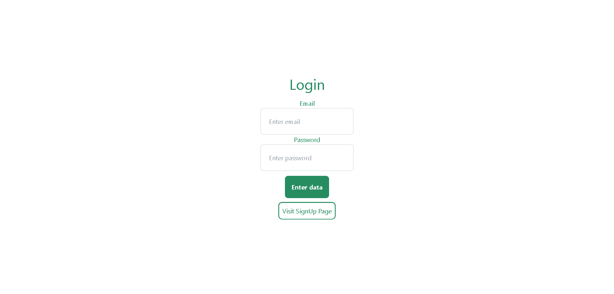
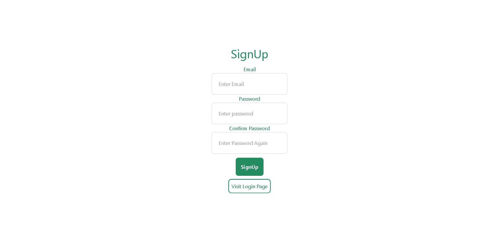
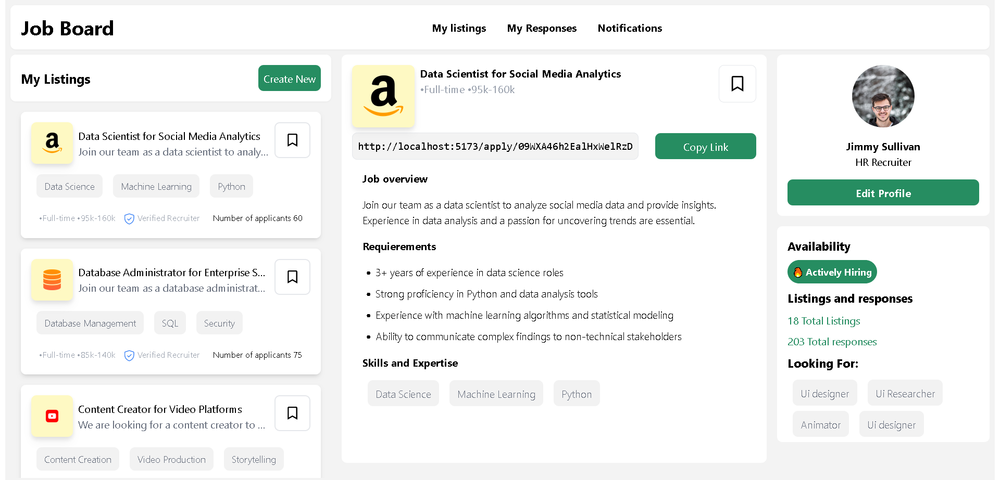
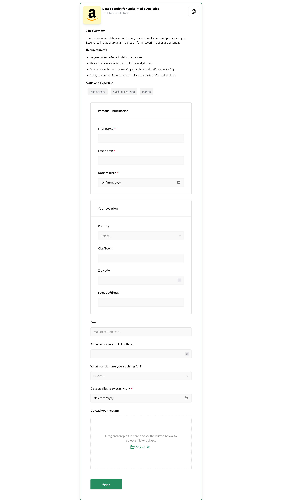
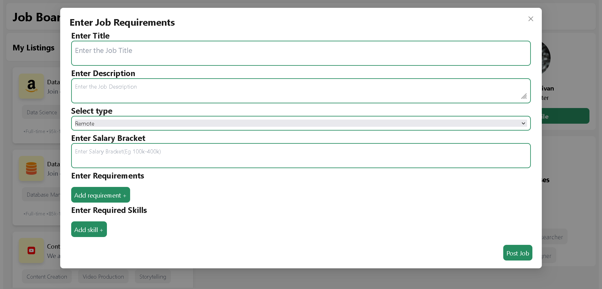
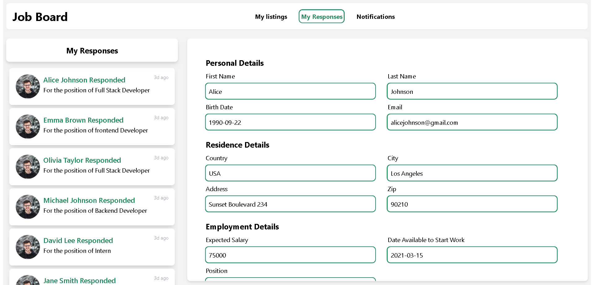
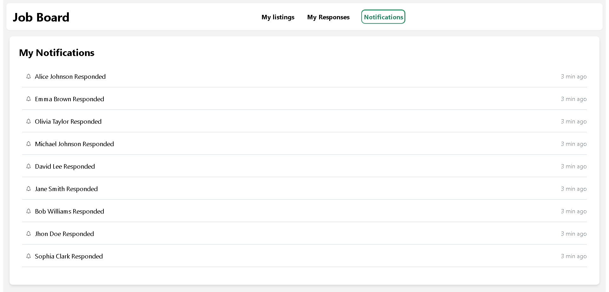

# Codepth Tech Hiring Challenge


Simple Job Portal Implementation with Firebase


## Screenshots










## Demo

**While using the demo site use this Id to login or you can always create a new one**
```
email: user@testmail.com
password : 123456
```


## Features

- User Authentication
- Create New Job listing
- View Responses Of Candidates
- See Notifications log


## Technologies Used

- React 
- React Router Dom
- Axios
- Redux 
- Firebase(for use auth and storage)
- React-hot-toast
- React-icons
- Tailwind Css
- Formik
- Yup(for form validation)
- Survey.js
- Ant design

## Installation ⚡

**1. Clone this repo by running the following command :-**

```bash
 git clone https://github.com/Akarshit7/hiring_portal_challenge_codepth
 cd 
```

**2. Now install all the required packages by running the following commands :-**

```
npm install
```

**2. Create your firebase project**

**3. Change the Credentials in the lib/firebase.js file**


**4. Now start the dev server by running the following command :-**

```
#Start dev the server
npm run dev
```

**5.** **🎉 Open your browser and go to `https://localhost:5173`**
